# Architecture

本文档用文字和 Mermaid 图梳理 AI Interview Platform 的整体架构、AI 调用链路、评分链路、数据库关系和前后端交互流程。

## 1. 整体架构

项目采用前后端分离架构：

- 前端：Vue 3 + TypeScript + Element Plus
- 后端：Spring Boot 3 + Spring Security + MyBatis-Plus
- 数据库：MySQL 8
- 缓存：Redis 7
- AI Provider：Mock / DeepSeek
- 文档与调试：SpringDoc OpenAPI / Swagger

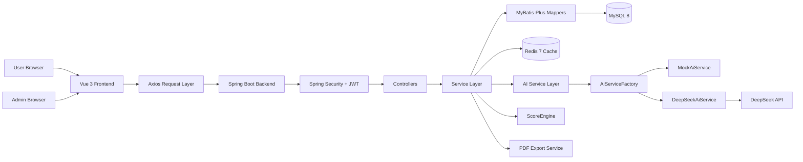

## 2. 后端分层

后端主要按业务模块拆分：

```text
common       统一返回、异常、分页
security     JWT、安全过滤器、用户详情
module/user  用户、角色、认证
module/question  题库、标签、管理员题目管理
module/answer    答题、收藏、错题本
module/statistics 学习统计
module/ai        AI 点评、模拟面试、追问、PDF、分享、成长分析
module/admin     管理员后台、平台统计
```

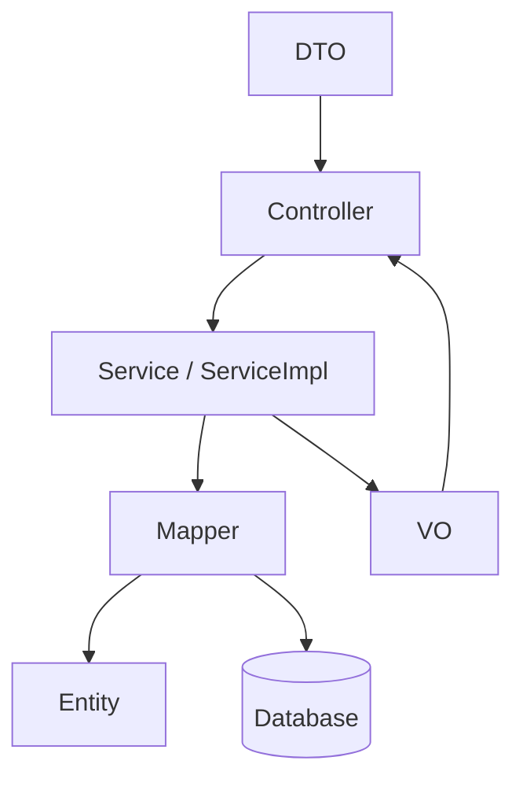

## 3. 前端架构

前端采用 Vue 3 + TypeScript，按接口、类型、页面、布局和状态管理拆分。

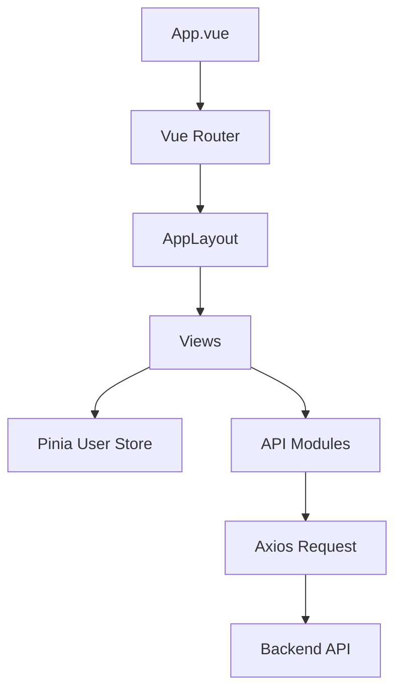

主要目录：

```text
frontend/src/api        接口封装
frontend/src/types      类型定义
frontend/src/stores     Pinia 状态
frontend/src/router     路由与权限守卫
frontend/src/layouts    通用布局
frontend/src/views      页面
frontend/src/utils      工具函数
```

## 4. AI Provider 调用链路

AI 调用通过 `AiService` 抽象，不直接把 DeepSeek 逻辑写死到业务 Service。

Provider 解析优先级：

```text
app.ai.provider
  ↓
APP_AI_PROVIDER
  ↓
AI_PROVIDER
  ↓
mock
```

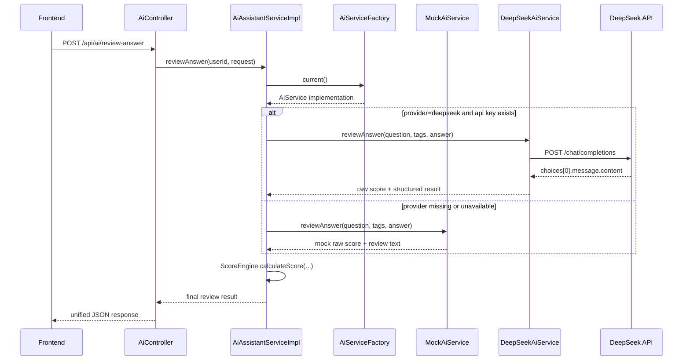

## 5. ScoreEngine 评分链路

`ScoreEngine` 是最终评分唯一入口。AI Provider 只负责生成原始分，最终分数由 `ScoreEngine` 统一计算。

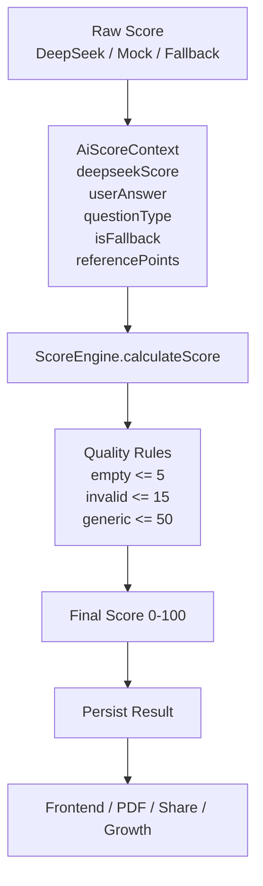

评分结果覆盖：

- 单题 AI 点评 `score`
- `structuredResult.score`
- 整场面试 `questionResults.score`
- 整场面试 `totalScore`
- PDF 报告
- 分享页
- 成长分析

可观测日志：

```text
traceId
questionType
isFallback
inputScore
finalScore
correctionReason
```

## 6. AI 模拟面试流程

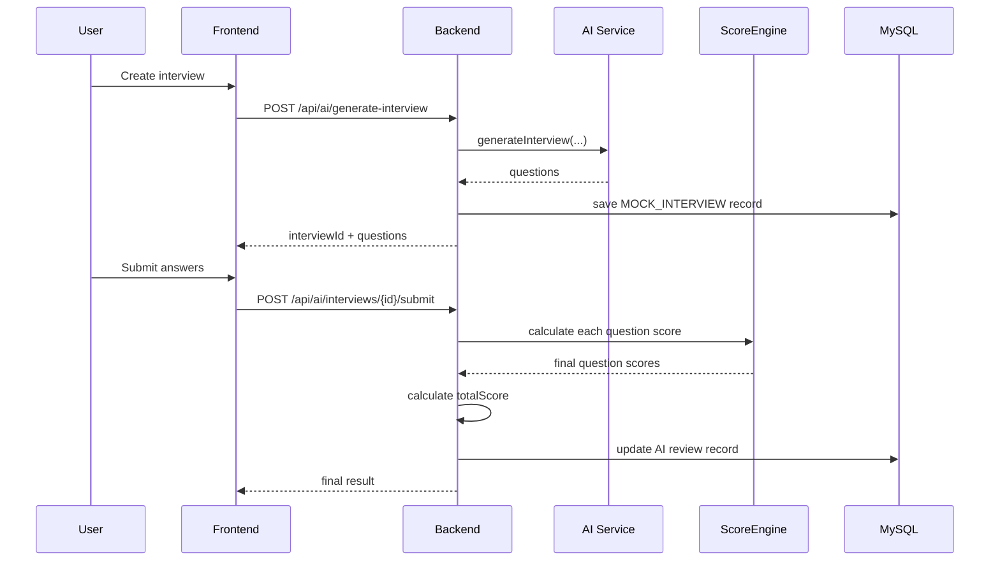

## 7. 多轮追问流程

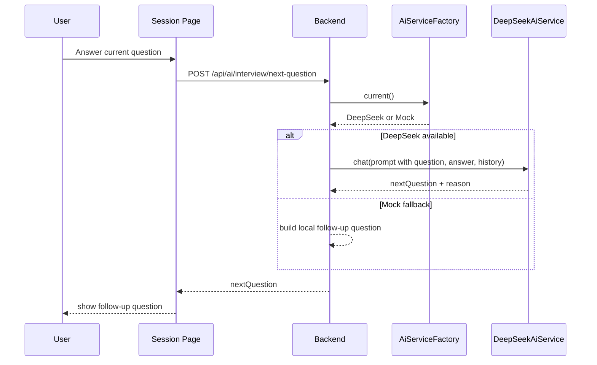

## 8. PDF 导出与分享流程

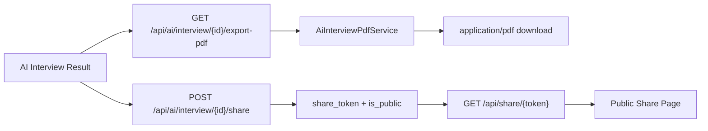

## 9. 数据库关系

主要数据表：

- `sys_user`
- `sys_role`
- `sys_user_role`
- `question`
- `question_tag`
- `question_tag_relation`
- `user_answer_record`
- `user_favorite`
- `user_wrong_question`
- `daily_learning_record`
- `ai_review_record`

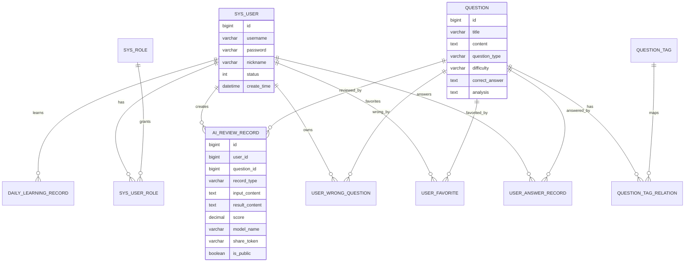

## 10. 前后端交互流程

以登录和刷题为例：

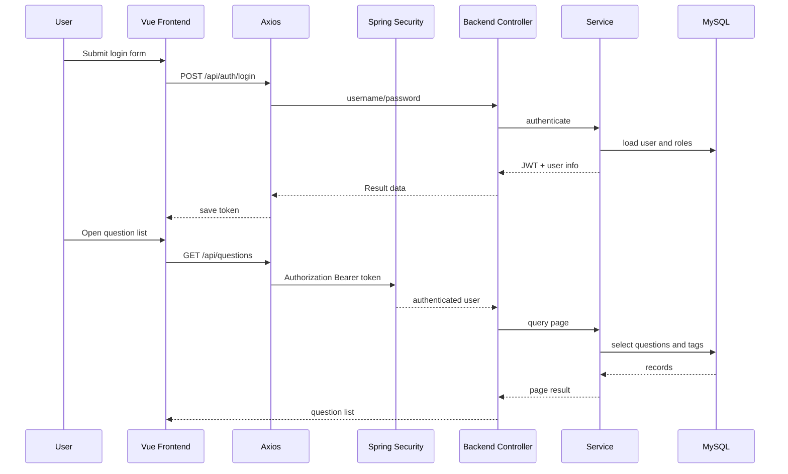

## 11. 管理端权限流程

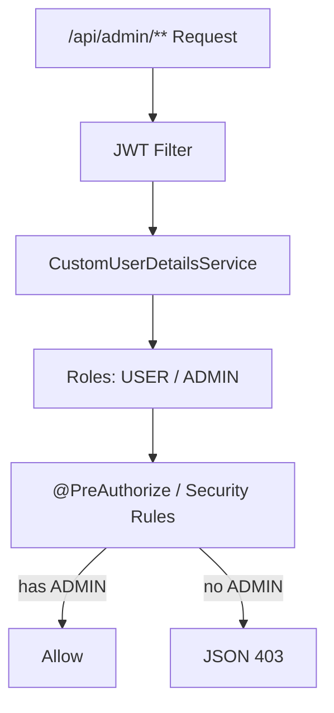

## 12. 缓存与一致性

Redis 主要用于统计结果缓存：

- 用户统计概览
- 管理员统计概览
- 平台趋势
- 热门题目
- 热门标签

缓存失效场景：

- 用户提交答案
- 用户收藏或取消收藏
- 删除错题
- 新增、修改、删除题目
- 新增 AI 记录
- 用户状态或角色变化

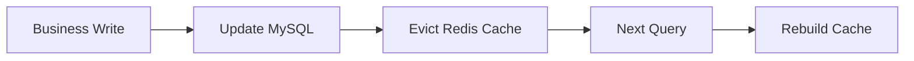

